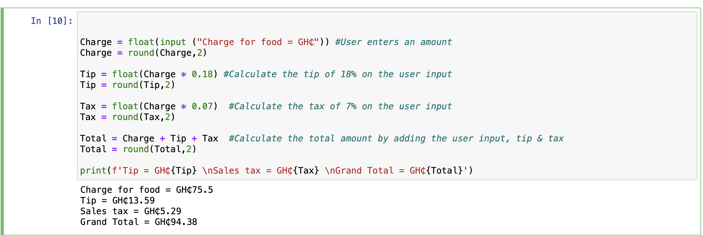

# tip-calculator
This Program calculates the total amount of a meal purchased with a Fixed Tip

# Question
As the finance officer of Asanka Hotel, the food and beverages director has requested a program that calculates the total amount of a meal purchased with a fixed tip.

**Below are the requirements for the program:**

The Program should ask the user to enter the charge for the food.
It should then calculate the amounts of an 18 percent tip and 7 percent sales tax on the charge of the food and display each of these amounts.

Finally, it should add everything together and display the charge of the food plus tip and sales tax.

Based on this data, your program should generate script that meets the requirements.

```
{
Charge = float(input ("Charge for food = GH₵")) #User enters an amount
Charge = round(Charge,2)

Tip = float(Charge * 0.18) #Calculate the tip of 18% on the user input
Tip = round(Tip,2)

Tax = float(Charge * 0.07)  #Calculate the tax of 7% on the user input
Tax = round(Tax,2)

Total = Charge + Tip + Tax  #Calculate the total amount by adding the user input, tip & tax
Total = round(Total,2)

print(f'Tip = GH₵{Tip} \nSales tax = GH₵{Tax} \nGrand Total = GH₵{Total}')
}
```

# The Result


# AUTHOR
Alberta Cofie

